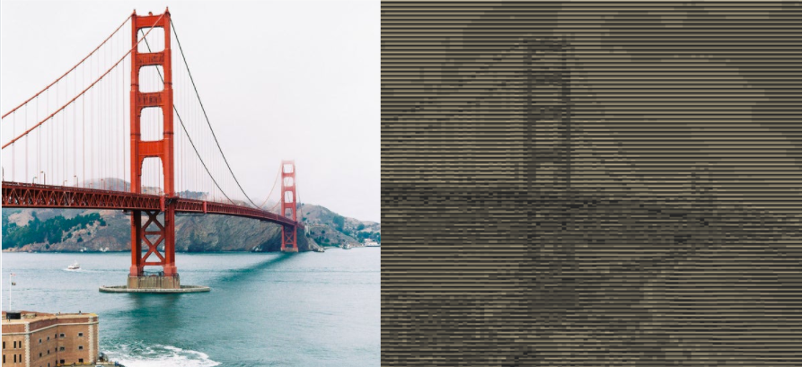

# convert-images-to-ASCII-art
Convert any image into ASCII art using Python. A simple and fun project. Using this idea you could do several other projects such as building an image using several other images.

# Video Tutorial
https://www.youtube.com/watch?v=ndEcVo4tezI
